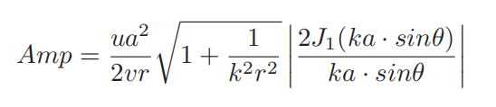
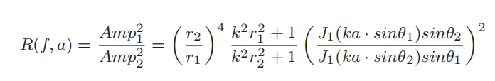
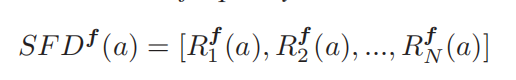

# Voice Liveness Detection with Sound Field Dynamics

## 术语表

* Automatic speaker verification(ASV):  自动语音识别
* Sound Field Dynamics (SFD): 声场动力学
* Amplitude(Amp): 信号幅度

## Introduction

### Insight
人类和扬声器之间的本质差异是发声孔径大小的变化。具体来说，人类需要动态地张开和闭合嘴来发出语音命令，而扬声器保持固定的孔径大小。直观地说，人类的时变开口比扬声器带来更为动态的声场。通过检查声场的动态水平，我们可以区分声音的活跃度，即回避命令是来自真实用户的嘴巴还是扬声器。

### Challenge
* 如何描述声场的动态水平
* 考虑到阵列中通常有多个麦克风，需要正确处理所有麦克风通道以便于测量
* 根据我们测量的特征，设计一种有效的方法来区分人类和扬声器

### Solution
声场动力学SFD基于不同麦克风之间能量比的时间波动

优点：

（i） 语音内容被取消，攻击者很难操纵语音来愚弄我们的系统。

（ii）这种相对划分消除了绝对声音强度的影响，因此SFD独立于音量。

(iii)此外，SFD基本上取决于声源的物理孔径大小变化，而与声源位置无关。

Based on the extracted SFDfeatures, we design a deep learning model with a self-attention mechanism to further fuse multiple channels and differentiate humans and loudspeakers

## 声场动力学

### 声场与方向性

声场描述了声源在空间上的能量扩散，在不同的位置有不同的声功率，形成声音的指向性。

衍射效应与声音叠加和干扰一起产生了声音的方向性。声音方向性取决于两个因素：信号频率f和孔径大小a

### 建模

声音方向性导致声场中不同位置的声音功率水平不同，而一个位置功率的时间变化间接描述了声音方向性的变化

为消除音量的影响，通过计算不同麦克风的能量比来处理

通过公式计算，能量比仅依赖于源孔径与信号频率，定义SFD为整个频带中能量比随时间的变化(a为孔径)

N为时域中语音命令的帧号，将语音信号转换为每个短帧的频域，则变量可视为恒定频率向量，而孔径大小为唯一变量，即人与扬声器的关键区别。

## System

Voshield由三个部分组成：Pair Fusion, SFD Pattern Extraction, Liveness Detection.

* 检查麦克风阵列布局，选择多个麦克风对以覆盖所有可能的传入语音方向
* 在SFD模块提取特征，进行数据增强以训练模型
* SFD特征被送入分类器检测，活体判断

### Pair Fusion

选用平行+对角线的麦克风对，减少信息冗余同时保证全部方向角都考虑到

### SFD Pattern Extraction

## Implementation

## Evaluation

